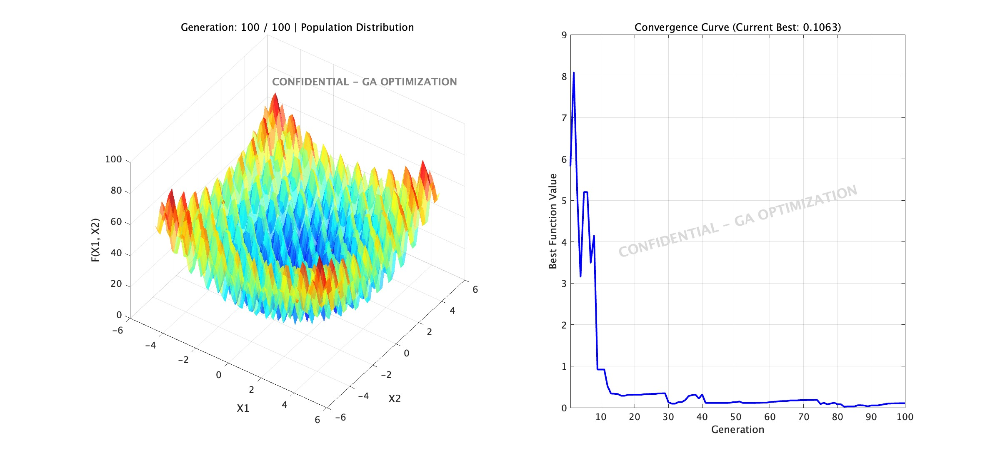

# Matlab-Simulation

A comprehensive repository for algorithm development and engineering simulation models using MATLAB, Python, C/C++, and LTspice.

## 🚀 Overview 
This project aims to provide practical implementations of various numerical algorithms and electronic/engineering simulation models. It bridges the gap between software algorithms and hardware circuit simulations.

### 📊 Optimization Result

## 🛠️ Tech Stack & Tools 
- **MATLAB**: Used for mathematical modeling, signal processing, and numerical analysis.
- **Python**: Used for rapid prototyping, data analysis, and automation scripts.
- **C/C++**: Used for performance-critical algorithm blocks and micro-controller simulation.
- **LTspice**: Used for analog circuit simulation and verification.

## 📂 Project Structure 
- `standard_ga_optimization02.m` - Standard Genetic Algorithm (GA) implementation script.
- `my_rsult.fig` - MATLAB figure saving the live optimization results (3D Rastrigin function landscape and convergence curve).

## ✍️ Author
- **Yasuo FUKAKI**
- LinkedIn: [Yasuo FUKAKI on LinkedIn](https://www.linkedin.com/in/yasuo-fukaki-620559255/)

### 📊 Optimization Result

